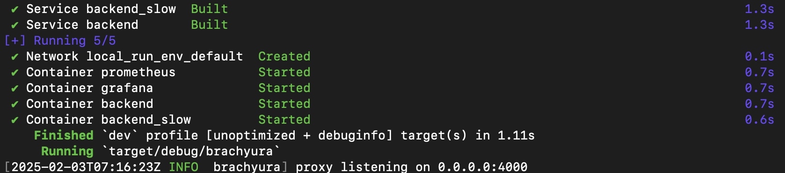

# Brachyura

A TLS terminating, load balancing reverse proxy, which I am using as a Rust learning project. **An experimental work in progress project.**

I utilize Nginx as part of my home lab providing reverse proxy functionality as well as TLS termination. The idea of this project is to replace Nginx with a light weight Rust based reverse proxy. Configurable via a yaml config file.

[](https://opensource.org/licenses/MIT)


## Quick Start
The repo contains a local [docker compose](https://github.com/docker/compose) based environment with example backend services, [Prometheus](https://github.com/prometheus/prometheus
) and [Grafana](https://github.com/grafana/grafana
) (for monitoring), all pre configured and including a Grafana dashboard.

Running `./local_run.sh` will start up the containers and run the proxy:



You can then send traffic to the load balanced backends via:
`curl -H "Host: test-lb.home" https://127.0.0.1:4000/ --insecure`

To access Grafana/Prometheus via the proxy you need to override your host header, the simplest way is to add both to your hosts file:
```
127.0.0.1 grafana.home
127.0.0.1 prometheus.home
```

Then browse to `https://prometheus.home:4000/` or `https://grafana.home:4000/`. There will be a certificate error as this is configured to use the example self signed certs in the repo.


## Configuration
Configured in `config.yaml`

### TLS config
The key and cert paths are also defined in the yaml file. Only the connection between the client and proxy is encrypted.

### Timeout config
There is an optional global timeout config value in milliseconds (see the example config file) which applies to all connections from the proxy to backends. Defaults to 60 seconds if not configured.

### Proxy backend config

The proxy uses the host header to decide where to send the request, and this is configured in the yaml config file under "backends". The host header needs to match the name value, then the request is proxied to the location. For example:

    backends:
      - name: "origin.home"
        location: "127.0.0.1:10000"

A request with the host header `origin.home` would be proxied to `127.0.0.1:10000`

**Load balancing**

Multiple backends can be defined for a given host header, where requests to these backends is load balanced. Currently only round robin load balancing is supported. Example config:

    backends:
      - name: "test-lb.home"
        backend_type: "loadbalanced"
        locations:
          - "127.0.0.1:8000"
          - "127.0.0.1:8001"


---

## Testing

### Tests

Unit and integration tests can be run via `cargo test -- --test-threads=1`, single thread mode is required for the integration tests.

## Running

**Requirements**
* A configured TLS key and cert
* A running backend / origin server
* A configuration file defining the proxy listen address / port, as well as a backend server config

The server can simply be run via `cargo run`. Below are some curl manual test examples (using self signed certs).

**HTTP 1.1 client example**

```
curl -v --http1.1  https://localhost:4000/ -H "Host: origin.home" --insecure

> GET / HTTP/1.1
> Host: origin.home
> User-Agent: curl/7.68.0
> Accept: */*
>
* TLSv1.3 (IN), TLS handshake, Newsession Ticket (4):
<
This is the Python origin server, listening on port: 10000 request HTTP version: HTTP/1.1
```

**HTTP 2 client example**

```
curl -v --http2  https://localhost:4000/ -H "Host: origin.home" --insecure

> GET / HTTP/2
> Host: origin.home
> user-agent: curl/7.68.0
> accept: */*
>
* TLSv1.3 (IN), TLS handshake, Newsession Ticket (4):
<
This is the Python origin server, listening on port: 10000 request HTTP version: HTTP/1.1
```

You will notice that the origin server reports an HTTP 1.1 protocol, this is due to the code currently downgrading the downstream connection, see the code for more details.