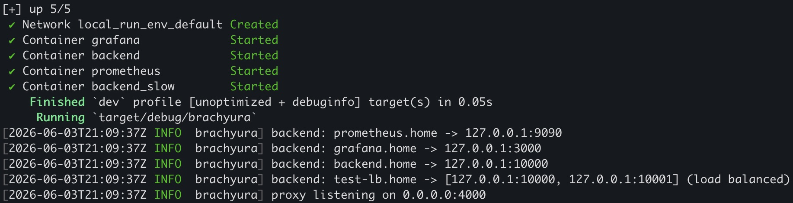

# Brachyura

A TLS terminating, load balancing reverse proxy, built as a Rust learning project. Functional and well tested, but not intended for production use.

I use Nginx in my home lab for reverse proxying and TLS termination. The goal of this project is to replace it with a lightweight Rust based alternative, built on [axum](https://github.com/tokio-rs/axum), [hyper](https://github.com/hyperium/hyper) and [tokio](https://github.com/tokio-rs/tokio), and configured via a single YAML file.

[](https://opensource.org/licenses/MIT)

[](https://deps.rs/repo/github/wjhoward/brachyura)

## Features

* TLS termination (connection between client and proxy is encrypted)
* Host header based routing to backends
* Round robin load balancing across multiple backends
* Prometheus metrics endpoint
* OpenTelemetry trace export over OTLP (viewable in Jaeger)
* Graceful shutdown with a configurable connection drain timeout
* Sets X-Forwarded-For on proxied requests
* HTTP/1.1 and HTTP/2 support from clients

## Quick Start
The repo contains a local [docker compose](https://github.com/docker/compose) based environment with example backend services, [Prometheus](https://github.com/prometheus/prometheus
), [Grafana](https://github.com/grafana/grafana
) and [Jaeger](https://github.com/jaegertracing/jaeger
) (for monitoring and tracing), all pre configured and including a Grafana dashboard.

Running `./local_run.sh` will start up the containers and run the proxy:



You can then send traffic to the load balanced backends via:
`curl -H "Host: test-lb.home" https://127.0.0.1:4000/ --insecure`

To access Grafana/Prometheus via the proxy you need to override your host header, the simplest way is to add both to your hosts file:
```
127.0.0.1 grafana.home
127.0.0.1 prometheus.home
```

Then browse to `https://prometheus.home:4000/` or `https://grafana.home:4000/`. There will be a certificate error as this is configured to use the example self signed certs in the repo.

Request traces are exported to Jaeger, browse to `http://localhost:16686` and select the `brachyura` service to view them.


## Configuration
Configured in `config.yaml`

### TLS config
The key and cert paths are also defined in the yaml file. Only the connection between the client and proxy is encrypted.

### Timeout config
There is an optional global `timeout_ms` value in milliseconds (see the example config file) which applies to all connections from the proxy to backends. Defaults to 60 seconds if not configured.

### Drain timeout config
On shutdown (SIGINT or SIGTERM) the proxy stops accepting new connections and waits for in flight requests to complete before exiting. The optional `drain_timeout_secs` value sets how long to wait before forcibly closing remaining connections. Defaults to 10 seconds if not configured.

### Proxy backend config

The proxy uses the host header to decide where to send the request, and this is configured in the yaml config file under "backends". The host header needs to match the name value, then the request is proxied to the location. For example:

    backends:
      - name: "origin.home"
        backend_type: "single"
        location: "127.0.0.1:10000"

A request with the host header `origin.home` would be proxied to `127.0.0.1:10000`

**Load balancing**

Multiple backends can be defined for a given host header, where requests to these backends is load balanced. Currently only round robin load balancing is supported. Example config:

    backends:
      - name: "test-lb.home"
        backend_type: "loadbalanced"
        locations:
          - "127.0.0.1:8000"
          - "127.0.0.1:8001"


---

## Internal endpoints

The proxy exposes two internal endpoints which are served directly rather than proxied to a backend. They are gated behind the `x-no-proxy` header (the same header the proxy sets on forwarded requests to prevent loops):

* `GET /status` returns a plain text message confirming the proxy is running
* `GET /metrics` returns Prometheus formatted metrics

Example:

    curl -H "x-no-proxy: true" https://127.0.0.1:4000/status --insecure

---

## Tracing

The proxy creates a span per request and can export traces via OpenTelemetry. Export is controlled by the `OTEL_TRACES_EXPORTER` environment variable, which is unset by default so nothing is exported. Set it to `stdout` to write spans to stdout for local debugging, or `otlp` to export over OTLP/gRPC to a collector such as Jaeger.

The OTLP endpoint defaults to `localhost:4317` and can be overridden with the standard `OTEL_EXPORTER_OTLP_ENDPOINT` variable. `./local_run.sh` sets `OTEL_TRACES_EXPORTER=otlp` and runs a Jaeger container, so traces are viewable at `http://localhost:16686`.

---

## Testing

### Tests

Unit and integration tests can be run via `cargo test`.

## Running

**Requirements**
* A configured TLS key and cert
* A running backend / origin server
* A configuration file defining the proxy listen address / port, as well as a backend server config

The server can simply be run via `cargo run`. Below are some curl manual test examples (using self signed certs).

**HTTP 1.1 client example**

```
curl -v --http1.1  https://localhost:4000/ -H "Host: origin.home" --insecure

> GET / HTTP/1.1
> Host: origin.home
> User-Agent: curl/7.68.0
> Accept: */*
>
* TLSv1.3 (IN), TLS handshake, Newsession Ticket (4):
<
This is the Python origin server, listening on port: 10000
request HTTP version: HTTP/1.1
```

**HTTP 2 client example**

```
curl -v --http2  https://localhost:4000/ -H "Host: origin.home" --insecure

> GET / HTTP/2
> Host: origin.home
> user-agent: curl/7.68.0
> accept: */*
>
* TLSv1.3 (IN), TLS handshake, Newsession Ticket (4):
<
This is the Python origin server, listening on port: 10000
request HTTP version: HTTP/1.1
```

You will notice that the origin server reports an HTTP 1.1 protocol, this is due to the code currently downgrading the downstream connection, see the code for more details.